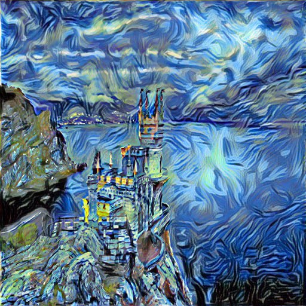

# Генерация изображений в стиле Ван Гога

Колаб ноутбук для генерации изображений в стиле Ван Гога:

Также код можно посмотреть [здесь](VanGoghStyleTransfer.ipynb).

[Видео](https://drive.google.com/drive/folders/1bDnoJR1zeKqE1pFCIn1EPzEkN3smepGc?usp=sharing) с демонстрацией работы
